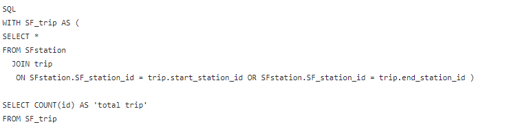
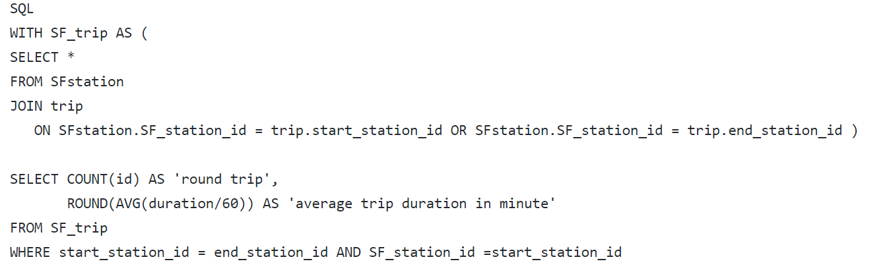
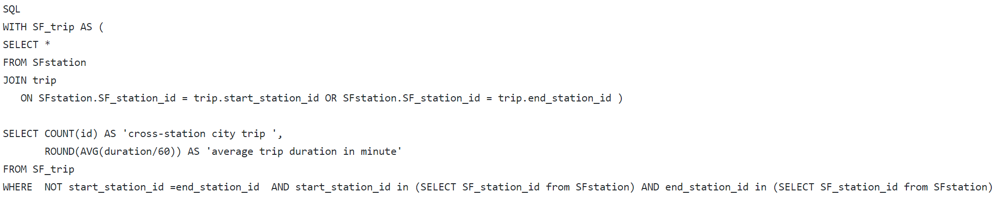
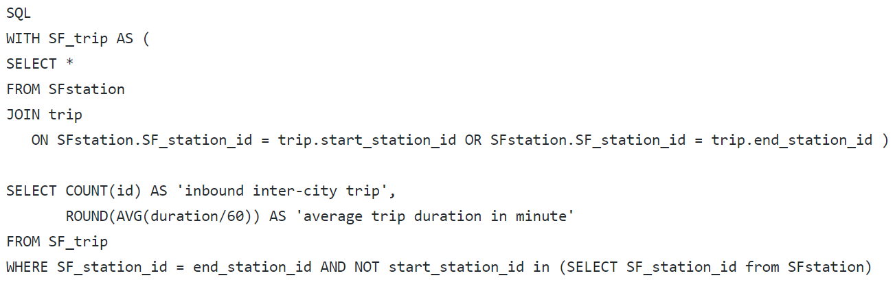
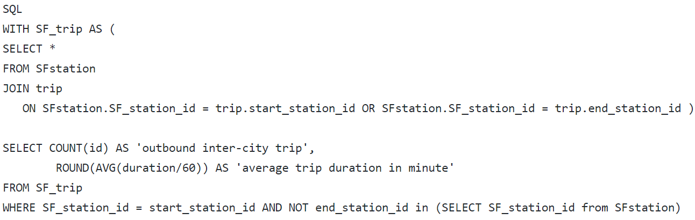
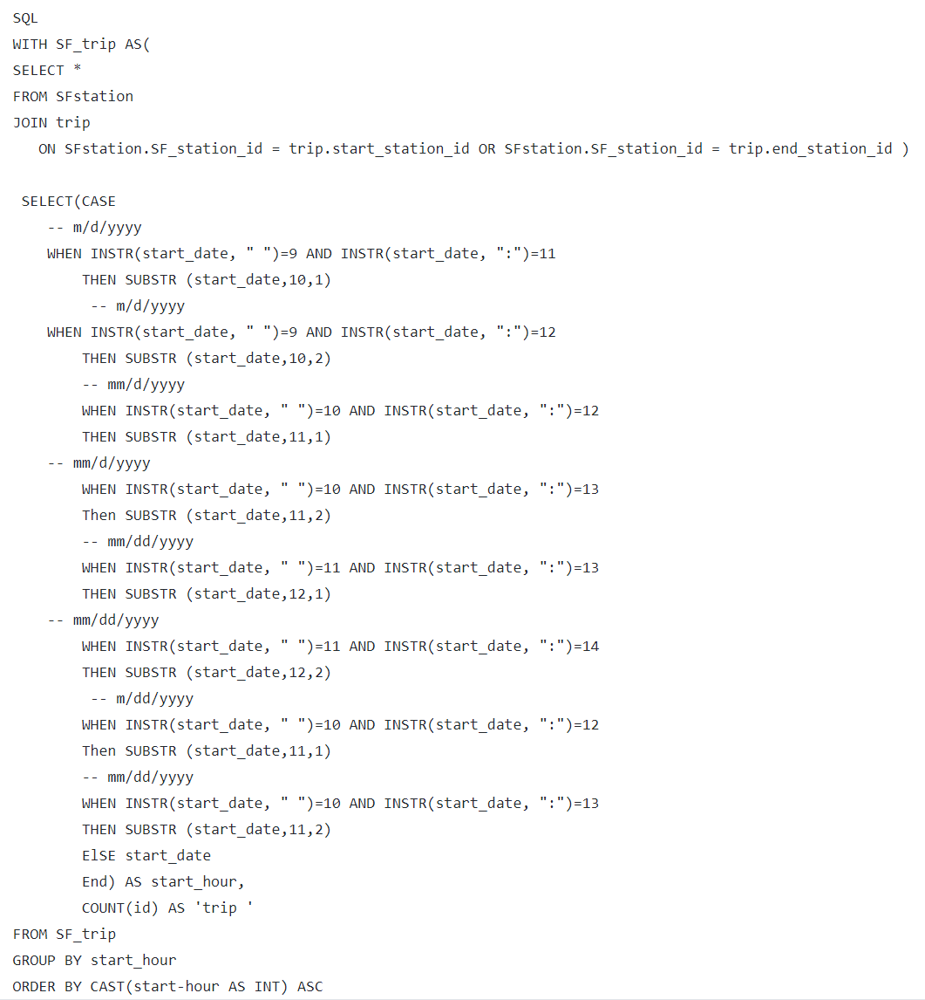
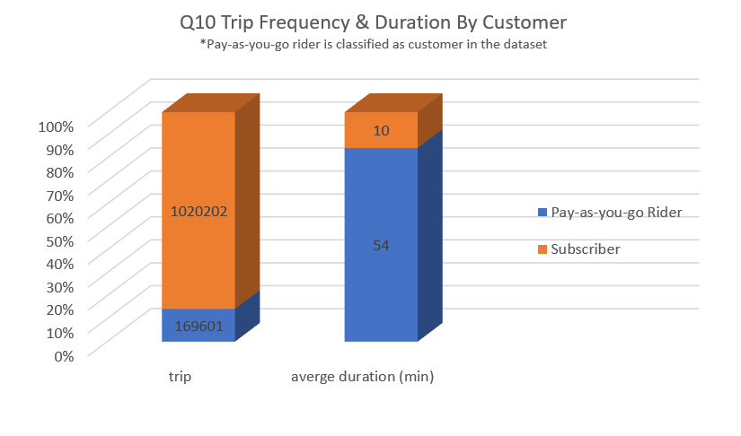

# SQL Analysis SF Bay Area Bike Share

## Overview

I am here to perform an exploratoray analysis on SF BAy Area bike Share Database using SQL (via DB BRowser For SQLite). The Bay Area Bike Share Scheme enables quick and affordable bike trips around the San Francisco Bay area. 

## Goal
This project is to demonstrate proficiency in manupuating, aggregating and querying data from database files using SQL and the ablities to analytes these values in context.  

## Database Schema
This databases is a trasnferomed version of Bay Area Bike Share Open data and is available to download from [Kaggle-SF Bay Areas Bike Share](https://www.kaggle.com/benhamner/sf-bay-area-bike-share). There are 4 tables (i.e.station, status, trip, weather) inside the database and I added one table (i.e. SFstation) for the purpose of this project. For more infomration about each table structure, please scroll down and refer to Database Scheme-Appendix 1.

## Project Outline

I answered 10 questions over the course of this exploration. Each question and its relevant SQL commomnds are listed in one file. Static folder is where you can access the visuals of results from running SQL commands. 

## Project Highlight

## 1.One of more complex analysis is exploring different types of trips coming in or out of San Francisco.

First of all, I need to select all trips that either have start station or end station in San Francisco. To do so, I created an additional table that contains all bike-share stations in San Franciso and inner join it with the able trip.

After that, I then create conditions to differentiate the following 4 types of trips:

1.Round Trip Inside San Francisco:city trips coming in and out of the same station inside San Francisco

2.Cross-Station Cty Trip: city trips coming in and out of different stations inside San Francisco 

3.Inbound Inter-City Trip:inter-city trips coming in San Francisco 

4.Outbound Inter-City Trip:inter-city trips coming out of San Francisco

## 2.Extracting hour value for Q7 taught me the importance of data quality 

As I wanted to evaluate how trip frequency vary by the time of day, I needed to extract hour values. However, the datatype of the coloumn-'start date ('dd/mm/yyyy hh:mm') is not datetime but text. In this case, I could not use DATEPART function. Instead, I have to locate the position of ' ' and ':' using INSTR fucntion. After that, I used SUBSTR function to extract the sub-string that contains the hour value from the whole string. 

## One of more interesting analysis is exploring which customer types take more trips or take longer trips

## Database Schema-Appendix 1
#### Table 1-Station
| Data Name | Data Type | Note| 
| :---: |:---:| :---: |
|  id | INTEGER | Primary Key|
|  name | TEXT |   |
|lat |NUMERIC |  |
|long|NUMERIC |   |
|dock_count| INTEGER|   |
|city |TEXT|    |
|installation_date|TEXT|   |

#### Table 2-SFstation 
| Data Name | Data Type | Note|
| :---: |:---:| :---: |
|  SF_station_id | INTEGER | Primary Key|
|  SF_station_name | TEXT |   |
|location|TEXT|  |
###### Note: This is thta filtered table that contains all Bikeshare Stations in San Francisco 

#### Table 3-Status
| Data Name | Data Type | Note|
| :---: |:---:| :---: |
| station_id | INTEGER|  |
|bikes_available|INTEGER |  |
|docks_available|INTEGER||
|time|TEXT|Primary Key|

#### Table 4-trip
| Data Name | Data Type | Note|
| :---: |:---:| :---: |
|id|INTEGER|Primary Key|
|duration|INTEGER||
|start_date|TEXT||
|start_station_name| TEXT| |
|start_station_id|INTEGER||
|end_date| TEXT| |
|end_station_id| INTEGER ||
|bike_id| INTEGER ||
|subscription_type| TEXT ||
|zip_code|INTEGER||

#### Table 5-Weather
| Data Name | Data Type | Note|
| :---: |:---:| :---: |
| date|TEXT |Primary Key|
|max_temperature_f|INTEGER||
|mean_temperature_f|INTEGER||
|min_temperature_f|INTEGER||
|max_dew_point_f|INTEGER||
|mean_dew_point_f|INTEGER||
|min_dew_point_f|INTEGER||
|max_humidity|INTEGER||
|mean_humidity|INTEGER||
|min_humidity|INTEGER||
|max_sea_level_pressure_inches|NUMERIC||
|mean_sea_level_pressure_inches|NUMERIC||
|min_sea_level_pressure_inches|NUMERIC||
|max_visibility_miles|INTEGER||
|mean_visibility_miles|INTEGER||
|min_visibility_miles|INTEGER||
|max_wind_speed_mph|INTEGER||
|mean_wind_speed_mph|INTEGER||
|max_gust_speed_mph|INTEGER||
|precipitation_inches|INTEGER||
|cloud_cover|INTEGER||
|events| TEXT||
|wind_dir_degrees|INTEGER||
|zip_code|INTEGER||
