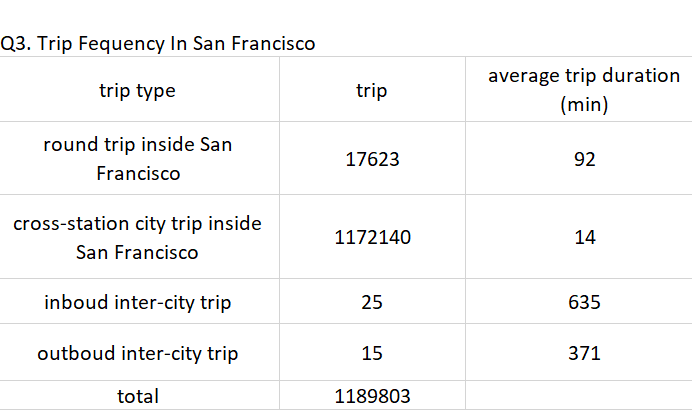
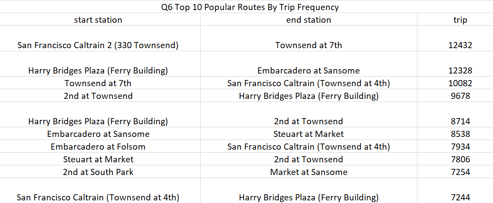

# SQL Analysis SF Bay Area Bike Share

## Overview

I am here to perform an exploratoray analysis on SF BAy Area bike Share Database using SQL (via DB BRowser For SQLite). The Bay Area Bike Share Scheme enables quick and affordable bike trips around the San Francisco Bay area. 

## Goal
This project is to demonstrate proficiency in manupuating, aggregating and querying data from database files using SQL and the ablities to analytes these values in context.  

## Database Schema
This databases is a trasnferomed version of Bay Area Bike Share Open data and is available to download from [Kaggle-SF Bay Areas Bike Share](https://www.kaggle.com/benhamner/sf-bay-area-bike-share). There are 4 tables (i.e.station, status, trip, weather) inside the database and I added one table (i.e. SFstation) for the purpose of this project. For more infomration about each table structure, please scroll down and refer to Database Scheme-Appendix 1.

## Repositary Outline
(I want to make it clear to viewer how they can know what question I am going to ask and what sql syntax i used to look for insights)

## Reflection

## Database Schema-Appendix 1
#### Table 1-Station
| Data Name | Data Type | Note| 
| :---: |:---:| :---: |
|  id | INTEGER | Primary Key|
|  name | TEXT |   |
|lat |NUMERIC |  |
|long|NUMERIC |   |
|dock_count| INTEGER|   |
|city |TEXT|    |
|installation_date|TEXT|   |

#### Table 2-SFstation 
| Data Name | Data Type | Note|
| :---: |:---:| :---: |
|  SF_station_id | INTEGER | Primary Key|
|  SF_station_name | TEXT |   |
|location|TEXT|  |
###### Note: This is thta filtered table that contains all Bikeshare Stations in San Francisco 

#### Table 3-Status
| Data Name | Data Type | Note|
| :---: |:---:| :---: |
| station_id | INTEGER|  |
|bikes_available|INTEGER |  |
|docks_available|INTEGER||
|time|TEXT|Primary Key|

#### Table 4-trip
| Data Name | Data Type | Note|
| :---: |:---:| :---: |
|id|INTEGER|Primary Key|
|duration|INTEGER||
|start_date|TEXT||
|start_station_name| TEXT| |
|start_station_id|INTEGER||
|end_date| TEXT| |
|end_station_id| INTEGER ||
|bike_id| INTEGER ||
|subscription_type| TEXT ||
|zip_code|INTEGER||

#### Table 5-Weather
| Data Name | Data Type | Note|
| :---: |:---:| :---: |
| date|TEXT |Primary Key|
|max_temperature_f|INTEGER||
|mean_temperature_f|INTEGER||
|min_temperature_f|INTEGER||
|max_dew_point_f|INTEGER||
|mean_dew_point_f|INTEGER||
|min_dew_point_f|INTEGER||
|max_humidity|INTEGER||
|mean_humidity|INTEGER||
|min_humidity|INTEGER||
|max_sea_level_pressure_inches|NUMERIC||
|mean_sea_level_pressure_inches|NUMERIC||
|min_sea_level_pressure_inches|NUMERIC||
|max_visibility_miles|INTEGER||
|mean_visibility_miles|INTEGER||
|min_visibility_miles|INTEGER||
|max_wind_speed_mph|INTEGER||
|mean_wind_speed_mph|INTEGER||
|max_gust_speed_mph|INTEGER||
|precipitation_inches|INTEGER||
|cloud_cover|INTEGER||
|events| TEXT||
|wind_dir_degrees|INTEGER||
|zip_code|INTEGER||
